# 📈 Autonomous Hedge Fund Analyst Team

An AI-powered multi-agent system that acts as a virtual hedge fund team. This application orchestrates a team of autonomous AI agents to research real-time news, analyze technical stock data, and generate professional investment reports for any given ticker symbol.
Try the application for yourself: 

## 🚀 Overview

This project implements an **agentic workflow** using [LangGraph](https://github.com/langchain-ai/langgraph). Instead of a single LLM trying to do everything, the system creates specialized "workers" that pass data between each other in a structured state.

**The Workflow:**
1.  **Researcher Agent**: Scours the web for the latest news and sentiment using the Tavily Search API.
2.  **Analyst Agent**: Fetches historical stock prices and technical data using YFinance.
3.  **Writer Agent**: Synthesizes the findings into a VP-level investment report with actionable recommendations.

## 🏗️ Architecture

The system is built on **LangGraph**, which allows for cyclic and stateful multi-agent orchestration. The frontend is powered by **Streamlit**.

```mermaid
graph LR
    Start --> Researcher[🔎 Researcher Agent]
    Researcher --> Analyst[📈 Analyst Agent]
    Analyst --> Writer[✍️ Writer Agent]
    Writer --> End
    
    style Researcher fill:#e1f5fe,stroke:#01579b,stroke-width:2px
    style Analyst fill:#fff9c4,stroke:#fbc02d,stroke-width:2px
    style Writer fill:#e8f5e9,stroke:#2e7d32,stroke-width:2px
```



🛠️ Tech Stack
- **Orchestration**: LangGraph
- **Frontend**: Streamlit
- **LLM**: OpenAI GPT-4o-mini
Tools:
- Tavily API (Real-time web search)
- YFinance (Stock market data)
- Language: Python 3.10+

## 📂 Project Structure
hedge-fund-analyst/
├── src/
│   ├── agents/
│   │   ├── researcher.py    # Gathers news & sentiment
│   │   ├── analyst.py       # Fetches stock price history
│   │   └── writer.py        # Writes the final report
│   ├── tools/
│   │   ├── search_tool.py   # Wrapper for Tavily API
│   │   └── finance_tool.py  # Wrapper for YFinance
│   ├── graph.py             # LangGraph state & edge logic
│   └── state.py             # Defines the shared state schema
├── app.py                   # Streamlit Frontend
├── requirements.txt         # Project dependencies
├── .env                     # API keys (Not uploaded to git)
└── README.md

⚡ Installation & Setup

1. Clone the Repository
```Bash
git clone [https://github.com/yourusername/hedge-fund-analyst.git](https://github.com/yourusername/hedge-fund-analyst.git)
cd hedge-fund-analyst
```

2. Set Up a Virtual Environment
It is recommended to use a virtual environment to avoid dependency conflicts.
macOS/Linux:
```Bash
python3 -m venv venv
source venv/bin/activate
```
Windows:
```Bash
python -m venv venv
venv\Scripts\activate
```

3. Install Dependencies
```Bash
pip install -r requirements.txt
```

4. Configure API Keys
Create a .env file in the root directory and add your keys:
```Bash
OPENAI_API_KEY=your_openai_key_here
TAVILY_API_KEY=your_tavily_key_here
```
Get OpenAI Key
Get Tavily Key (Required for search agent)

🏃‍♂️ Usage

Run the Streamlit application:

```Bash
streamlit run app.py
```
Open your browser to the local URL provided (usually http://localhost:8501).

Enter a stock ticker (e.g., AAPL, TSLA, MSFT) in the sidebar.

Click Run Analysis.

Watch as the agents sequentially gather data and produce a final report.

📝 Example Output
Input: MSFT

Agent Output:

📊 Investment Report: MSFT

📝 Executive Summary
Microsoft continues to show strong resilience in the cloud sector...

📉 Key Risks & Opportunities
Opportunity: Integration of AI features into Office 365...

Risk: Regulatory inspection in the EU...

🚀 Recommendation
BUY. The technical indicators over the last 5 days suggest a breakout trend...

🤝 Contributing
Contributions are welcome! Please feel free to submit a Pull Request.
